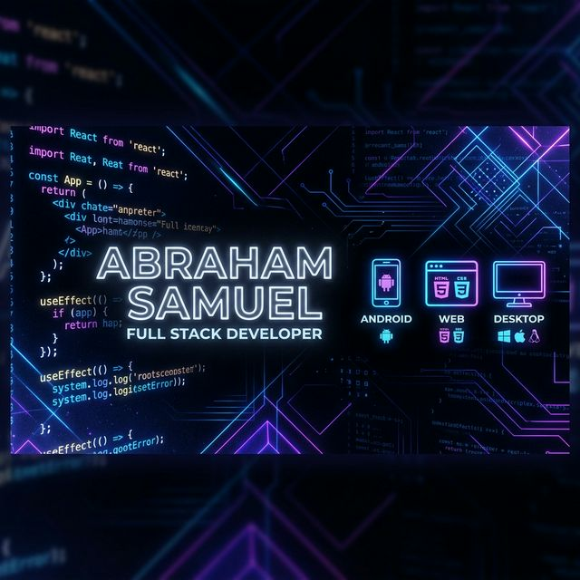

<!-- HEADER SECTION WITH ANIMATED WAVING HAND -->

  

<!-- TYPING ANIMATION -->

  

<!-- QUICK BIO WITH SOCIAL BADGES -->

  
  
  
  
  

<!-- BANNER IMAGE - REPLACE WITH YOUR CUSTOM BANNER -->

  

<!-- ABOUT ME SECTION WITH MODERN CARD DESIGN -->
##  About Me

<table align="center">
  <tr>
    <td width="60%">
      
✨ I'm a passionate developer dedicated to creating elegant, efficient solutions that blend technical precision with thoughtful design.

🚀 Currently building **cross-platform desktop applications** with Electron and React

🎯 **2024 Goals:** Contribute to open source & launch my SaaS product

💡 Fun fact: I can solve a Rubik's cube in under 2 minutes while debugging code!

📚 When I'm not coding, you'll find me reading tech blogs or exploring UI/UX trends

    </td>
    <td width="40%" align="center">
      
    </td>
  </tr>
</table>

<!-- SKILLS SECTION WITH ANIMATED BADGES -->
##  Technical Arsenal

### 💻 Programming Languages

  
  
  
  
  
  

### 🎨 Frontend & Mobile

  
  
  
  
  
  
  

### 🗄️ Backend & Database

  
  
  
  
  

### 🛠️ Tools & Platforms

  
  
  
  
  
  
  

<!-- STATISTICS SECTION WITH MODERN CARDS -->
## 📊 GitHub Analytics

  

  

<!-- ACTIVITY GRAPH -->

  

<!-- FEATURED PROJECTS WITH MODERN CARDS -->
## 🚀 Featured Projects

  
  

  
  

<!-- PROJECT SHOWCASE WITH DETAILS -->
### 🔥 Highlighted Project: [Voucherly – Desktop Invoicing Solution](https://github.com/AbrahamSamuel2003/Voucherly)
> A cross-platform desktop application built using Electron and React to provide a lightweight, offline-first invoicing alternative. Features include PDF generation, client management, and expense tracking.

### 💼 [Intern Management System (IMS)](https://github.com/AbrahamSamuel2003/IMS)
> A comprehensive web platform streamlining the internship lifecycle with role-based dashboards, task automation, and real-time progress tracking.

### 🤖 [Fitness AI Companion](https://github.com/AbrahamSamuel2003/Fitness-AI)
> An intelligent Android app generating personalized workout plans based on user goals, fitness level, and available equipment using AI algorithms.

<!-- WAKATIME STATS - OPTIONAL -->
## ⏱️ Coding Activity

<!-- START: waka-box -->
<!-- Insert WakaTime stats here if you use it -->
<!-- END: waka-box -->

<!-- BLOG POSTS SECTION - OPTIONAL -->
## 📝 Latest Blog Posts
<!-- BLOG-POST-LIST:START -->
- [Building Cross-Platform Apps with Electron and React](https://dev.to/yourblog/electron-react-guide)
- [Getting Started with Android Development in 2024](https://dev.to/yourblog/android-dev-2024)
- [Why I Chose Tailwind CSS for My Projects](https://dev.to/yourblog/tailwind-css-benefits)
<!-- BLOG-POST-LIST:END -->

<!-- SUPPORT SECTION -->
## ☕ Support My Work

  
  
  

<!-- CONNECT SECTION WITH ANIMATED ICONS -->
## 🌐 Let's Connect

  
  
  
  
  

<!-- SNAKE ANIMATION CONTRIBUTION GRAPH -->

  <picture>
    <source media="(prefers-color-scheme: dark)" srcset="https://github.com/AbrahamSamuel2003/AbrahamSamuel2003/blob/output/github-contribution-grid-snake-dark.svg" />
    <source media="(prefers-color-scheme: light)" srcset="https://github.com/AbrahamSamuel2003/AbrahamSamuel2003/blob/output/github-contribution-grid-snake.svg" />
    
  </picture>

<!-- QUOTE OF THE DAY -->

  

<!-- FOOTER SECTION -->

  
  
  
  
  
⭐️ From [AbrahamSamuel2003](https://github.com/AbrahamSamuel2003)

